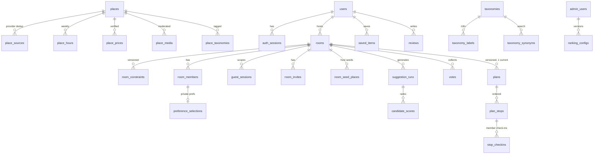

# GoGo Database — ERD & Conventions (DB-001)

Source of truth: `libs/database/src/schema/*.ts` (Drizzle). This doc records the
model shape and the conventions every migration must follow.

## Conventions

| Concern  | Rule                                                                                            |
| -------- | ----------------------------------------------------------------------------------------------- |
| Naming   | `snake_case` tables/columns; `*_id` FKs; enums as `pg` enums                                    |
| Keys     | `uuid` PKs, `gen_random_uuid()` default; app may supply v7 ids                                  |
| Time     | `timestamptz` only, UTC everywhere; `created_at`/`updated_at` on every mutable table            |
| Money    | `bigint` integer minor units + `char(3)` currency; interpretation via `budget_mode`/`unit`      |
| State    | Explicit `status` enums; transitions validated in application layer                             |
| Deletion | User-facing data: soft state (`status`, `removed_at`); sessions cascade                         |
| Secrets  | Only hashes persist: refresh tokens, guest tokens, invite codes (SHA-256)                       |
| Audit    | `audit_logs` append-only at app layer; sensitive writes must log                                |
| Geo      | `geometry(Point,4326)`; GiST indexes; PostGIS queries via raw SQL                               |
| Search   | `search_tsv` generated column (FTS) + `name_normalized` trigram; `f_unaccent` immutable wrapper |

## ERD (core relationships)

## Integrity anchors (tested in `libs/database/test/schema.int.spec.ts`)

- `plans_room_current_unique` — at most one `current` plan per room (FR-PLAN-001).
- `votes_room_member_target_unique` — idempotent votes (FR-SUG-004).
- `room_members_one_identity` — a membership is a user XOR a guest.
- `stop_checkins_bill_photo_required` — bill amount requires bill photo (FR-PLAN-009).
- `place_sources_provider_external_unique` — provider-level dedup (FR-CMS-004).
- `users_email_unique` partial — delete + re-register with same email works.
- Constraint edits bump `rooms.constraint_version`; anything referencing an
  older version is stale (enforced in application layer + `is_stale` flags).

## Retention (DB-010 targets)

- `room_constraints.origin_lat/lng` nulled after retention window (exact origin).
- `guest_sessions` purged after expiry + grace unless claimed.
- `login_attempts` purged after 30 days.
- `idempotency_keys` purged after `expires_at`.
- Account deletion: `users.status='deleted'`, PII columns nulled, content
  pseudonymized; export covers all actor-owned rows.
