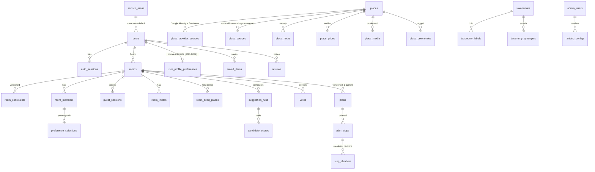

# GoGo Database — ERD & Conventions (DB-001)

Source of truth: `libs/database/src/schema/*.ts` (Drizzle). This doc records the
model shape and the conventions every migration must follow.

## Conventions

| Concern  | Rule                                                                                            |
| -------- | ----------------------------------------------------------------------------------------------- |
| Naming   | `snake_case` tables/columns; `*_id` FKs; enums as `pg` enums                                    |
| Keys     | `uuid` PKs, `gen_random_uuid()` default; app may supply v7 ids                                  |
| Time     | `timestamptz` only, UTC everywhere; `created_at`/`updated_at` on every mutable table            |
| Money    | `bigint` integer minor units + `char(3)` currency; interpretation via `budget_mode`/`unit`      |
| State    | Explicit `status` enums; transitions validated in application layer                             |
| Deletion | User-facing data: soft state (`status`, `removed_at`); sessions cascade                         |
| Secrets  | Only hashes persist: refresh tokens, guest tokens, invite codes (SHA-256)                       |
| Audit    | `audit_logs` append-only at app layer; sensitive writes must log                                |
| Geo      | `geometry(Point,4326)`; GiST indexes; PostGIS queries via raw SQL                               |
| Search   | `search_tsv` generated column (FTS) + `name_normalized` trigram; `f_unaccent` immutable wrapper |

## ERD (core relationships)

## Integrity anchors (tested in `libs/database/test/schema.int.spec.ts`)

- `plans_room_current_unique` — at most one `current` plan per room (FR-PLAN-001).
- `votes_room_member_target_unique` — idempotent votes (FR-SUG-004).
- `room_members_one_identity` — a membership is a user XOR a guest.
- `stop_checkins_bill_photo_required` — bill amount requires bill photo (FR-PLAN-009).
- `place_provider_sources_provider_external_unique` — one Google Place ID, one
  GoGo place, from every import door (#334). `place_sources_provider_external_unique`
  still guards the legacy table, whose `google` rows migration 0033 copies over
  and whose writer is gone.
- `provider_usage_meter_daily_key` / `provider_cost_daily_key` (#368) — the
  provider-agnostic usage-meter and cost tables (Cost Observability epic §9/§11).
  Unique over `COALESCE(operation_id,'')`, `COALESCE(billing_sku_id,'')` etc., so
  nullable ids stay nullable and `ON CONFLICT` names the same expressions. Usage
  and cost are **separate tables**: a meter row is a quantity of a unit, a cost
  row is an amount with a basis, and unknown cost is the absence of a row.
- `provider_usage_daily_pkey` / `provider_budget_daily_pkey` (#335) — usage
  accounting and the hard budget are **two tables, not one**. Usage says what
  happened and is written after the fact by a buffered ledger; the budget says
  what is allowed and is written before the provider call inside one
  transaction. `provider_usage_daily_succeeded_le_attempted` fails loudly if
  the ledger ever double-counts, because a wrong number here looks exactly like
  a right one. See ADR-0012.
- `users_email_unique` partial — delete + re-register with same email works.
- Constraint edits bump `rooms.constraint_version`; anything referencing an
  older version is stale (enforced in application layer + `is_stale` flags).

## Retention (DB-010 targets)

- `room_constraints.origin_lat/lng` nulled after retention window (exact origin).
- `guest_sessions` purged after expiry + grace unless claimed.
- `login_attempts` purged after 30 days.
- `idempotency_keys` purged after `expires_at`.
- Account deletion: `users.status='deleted'`, PII columns nulled, content
  pseudonymized; export covers all actor-owned rows.
- `media_uploads` rows still `pending` one day past `expires_at` purged; the
  bytes under `tmp/` expire by R2 lifecycle (ADR-0022).
- `media_cleanup_queue`: one row per object that must disappear, written in
  the same transaction as the change that unreferenced it; the worker retries
  the delete and dead-letters after six attempts (ADR-0022).

## Connection strategy (DB-002, #21)

**Pool size is per process, not per deployment.** The ceiling is the server's
`max_connections` divided by everything that connects: each api replica, the
worker, a migration run, and whatever an operator has open in psql. Sizing the
pool from the application's concurrency instead is how a deploy that doubles
replicas exhausts the database at the moment it is busiest.

`DB_POOL_MAX` defaults to 10, which fits a single-VPS MVP: default
`max_connections` of 100, roughly four connecting processes, with headroom for
a migration and a human. Raise it only together with `max_connections`, or put
a pooler in front.

`connectionTimeoutMillis` is 5s and deliberately short: a request queueing for
a connection is already a slow request, and failing it frees the client to
retry rather than holding a socket that will time out anyway.

**TLS is required in production.** `DATABASE_URL` must carry
`sslmode=require`, `verify-ca` or `verify-full`; boot fails otherwise. A
database link that quietly falls back to plaintext is the kind of thing nobody
notices until it turns up in a packet capture.

**An idle client losing its server must not crash the process.** `pg` emits
`error` on the pool when an idle connection dies, and an unhandled one takes
the process with it — the wrong outcome during a restart or failover, where
in-flight queries should fail and be retried while the API stays up.
